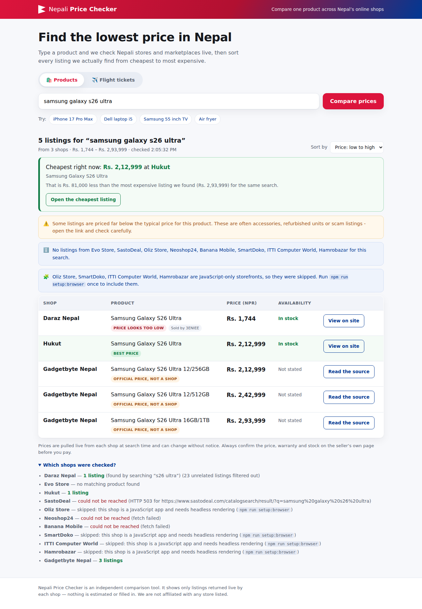
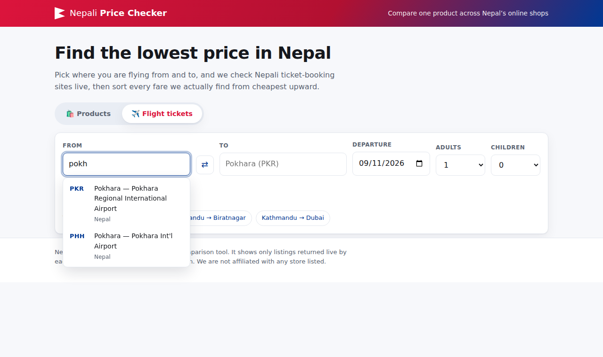
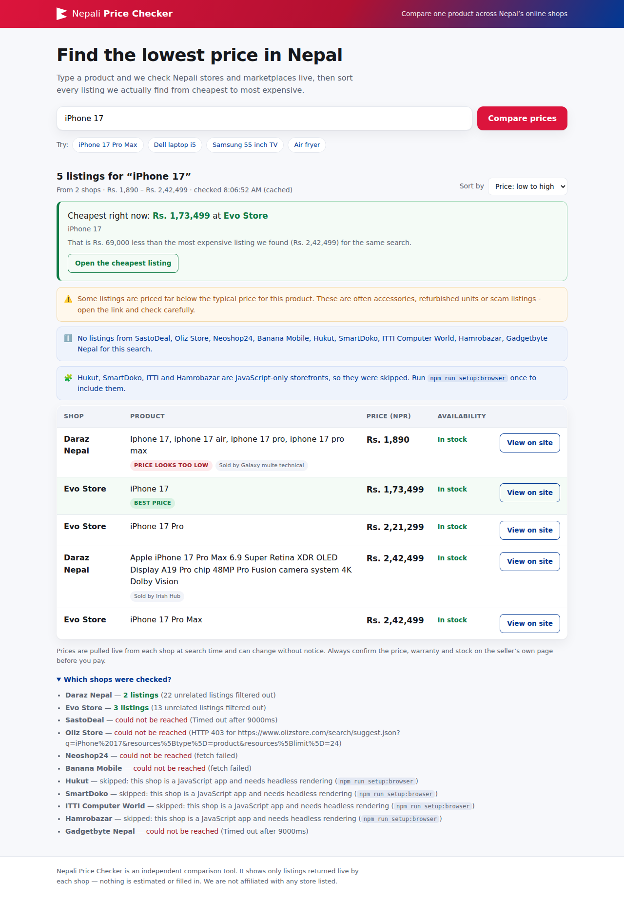
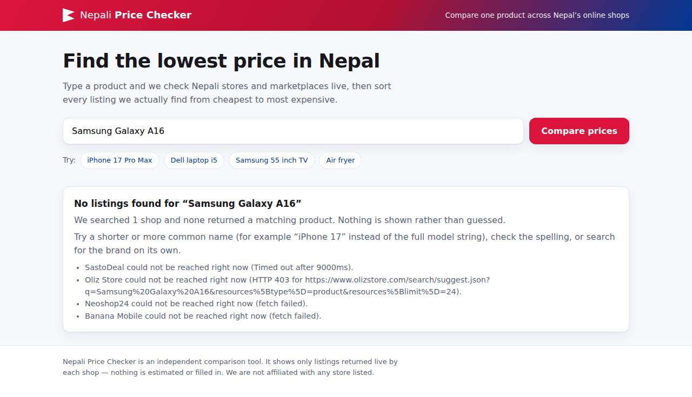
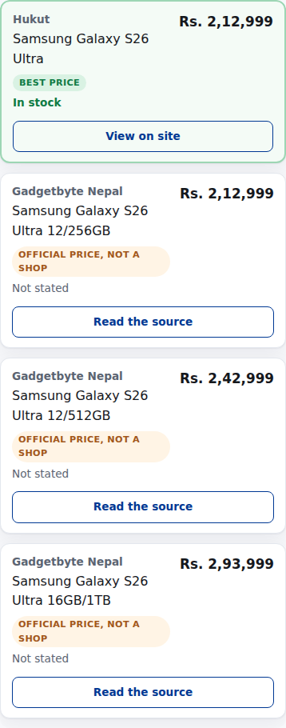

# Nepali Price Checker

A comparison website for Nepal, with two modes behind one search area:

- **Products** — type a product name once and see the listings each Nepali shop
  actually returns, sorted cheapest first.
- **Flight tickets** — pick where you are flying from and to, and see the fares
  each Nepali ticket-booking site actually quotes, sorted from lowest upward.

Nothing is estimated in either mode: a source that fails, is blocked or finds
nothing is reported as skipped rather than filled in.



## Running it

The server and front-end have no required dependencies — plain Node, plain
browser JavaScript.

```bash
npm start                 # http://localhost:3000
npm run setup:browser     # ONE-OFF: adds Hukut, SmartDoko, ITTI, Hamrobazar
npm run dev               # start with --watch reload
npm test                  # parsing, relevance, orchestrator, rendering
npm run check:stores -- "iphone 17"   # which shops your network can reach
```

**`npm run setup:browser` is optional.** Daraz, Hukut, Evo Store and
Gadgetbyte all work over plain HTTP with nothing installed. The command adds
SmartDoko, Hamrobazar, ITTI and the Oliz fallback, which are JavaScript-only
(see below). Without it they are skipped and the site still works.

Requires Node 18.17+ (Node 22 recommended). `PORT` and `HOST` are honoured.
`CHROMIUM_PATH` points at an existing Chromium build instead of downloading
one; `HTTPS_PROXY` is passed through to the browser.

## Flight fares



Switch to **✈️ Flight tickets** and the search area becomes From / To /
Departure / passengers. Both airport fields are comboboxes: type `pokh` and you
get Pokhara's two airports, `lukla` gets Tenzing-Hillary. Suggestions come from
a bundled dataset of every Nepali airport with scheduled service plus the
international destinations flown from Kathmandu, so they appear as fast as you
can type; a slower directory lookup is queried only when nothing bundled
matches. The visible field shows `Pokhara (PKR)` while a hidden field carries
the IATA code, so a half-typed city can never be submitted as a real airport.

Results are sorted by fare, with the lowest badged, and re-sortable by
departure time or airline. Fares are deep-linkable:
`/?mode=flights&from=KTM&to=PKR&date=2026-09-20`.

### Why flight fares need `setup:browser`

Products can often be read over plain HTTP. Fares cannot. Checked directly:
Buddha Air, Yeti, Shree, Himalaya, Nepal Airlines and Sastotickets publish **no
fare API, no fare deep link, and no static fare table** — Sastotickets' own
`/search-flight/<date>/<from>/<to>` style URLs all 404, and submitting its
search form over HTTP with a valid CSRF token and session cookie redirects
straight back to the homepage. A fare only exists after a booking form has been
submitted, so `src/flights/sastotickets.js` fills and submits that form in a
real browser and reads the resulting fare table.

Sastotickets is the first provider because one search returns fares across
every domestic carrier plus international routes — one browser flow instead of
six airline scrapers. Per-airline providers are worth adding for cross-checking
and go in `src/flights/`; the registry in `src/flights/index.js` documents the
interface.

Fare rows are found by what a fare row unavoidably contains — a price, a
departure time and an airline name, all in the same element — rather than by
per-site CSS selectors, which change without notice. `test/flights.test.js`
runs that extractor against a fixture results page that includes the noise a
naive price scraper would misread: a promo banner (price, no time), a baggage
fee table (prices, no times) and a check-in notice (times, no price).

**Honest status:** the flight UI, airport lookup, validation, orchestration and
fare-row extraction are all verified by tests. The Sastotickets browser flow is
written against that site's real form markup and validation rules, but could
not be run against the live site from the cloud host this was built on, because
Chromium there has no outbound network. Run it on a normal connection with
`RENDER_DEBUG=1 npm start` to see exactly what the browser saw.

## What it does

1. You search, e.g. `iPhone 17 Pro Max`.
2. The server queries every enabled store adapter **in parallel** with a 9s
   per-store timeout, so one slow shop can't hold up the page.
3. Listings are filtered for relevance, converted to NPR where needed,
   de-duplicated, and sorted by price.
4. The page renders a sortable table (stacked cards on phones) with a
   cheapest-option callout, a "Best price" badge, availability, seller, and a
   **View on site** link.

### Design decisions worth knowing

**Nothing is ever invented.** If a store errors, times out, gets blocked, or
returns no match, it is reported as skipped and contributes zero rows. The
"Which shops were checked?" panel shows exactly what happened to each one, so
a short table is explained rather than mysterious.



**The query is read for intent, not matched literally.** Shops phrase the same
product half a dozen ways and shoppers type it a seventh, so `src/query.js`
turns a raw query into a canonical form plus the wordings worth trying. Three
searches that returned nothing before it existed, all reproduced live:

| You type | What broke | What happens now |
|---|---|---|
| `samsung galaxy s26 ultra` | Daraz titles read "Samsung S26 Ultra" — no "Galaxy" | Brand and product-line words are **optional** when matching titles, so both spellings match |
| `iphone 17 pm` | no title spells "pm" | Shorthand is expanded to `pro max` |
| `samsng galaxy s26` | one missing letter, no results anywhere | Corrected against a known vocabulary before the store is asked, and single typos still match titles |

Each store gets up to three wordings — as typed, corrected/expanded, then with
the brand dropped (which is what Daraz's index actually answers) — and only
while nothing relevant has come back. Whatever returns is still judged against
the shopper's canonical intent, so this widens the net rather than loosening
the standard, and the store panel names the wording that found the product.
Digits are never "corrected": `s26` and `s25` are one edit apart and different
phones. A title naming a different brand is rejected however well the model
number lines up.

**Accessories are filtered out.** Searching `iPhone 14 128GB` on Daraz returns
page after page of phone cases at Rs. 200–900. Without filtering, "Best price"
would land on a silicone cover. `src/relevance.js` requires ≥70% of the query's
tokens to appear in the title (with `128 GB` normalised to `128gb`) and rejects
accessory keywords — unless you actually searched for an accessory, in which
case the rule inverts. Rows that match only part of the query are labelled
**Closest match**, so a near-miss is visible rather than silent.

**Suspiciously cheap rows are flagged, not hidden.** Anything under 35% of the
median price for that search gets a "Price looks too low" tag and a warning
about accessories, refurbished units and scam listings; the "Best price" badge
skips those rows and lands on the cheapest credible one. Two rows are enough to
make that call — a Daraz listing titled exactly "Samsung Galaxy S26 Ultra" at
Rs. 1,744 sitting next to Hukut's Rs. 2,12,999 is precisely what the flag is
for, and requiring three rows once let it take the badge.

**Currency conversion is labelled.** Non-NPR prices are converted using live
rates from `open.er-api.com` (cached an hour) and the row shows the original
amount and rate used. If the rate lookup fails, a pinned fallback table is used
and the response marks the rate approximate.

**Results are cached 10 minutes** per query, so re-sorting or sharing a link
doesn't re-hammer the stores. `?fresh=1` on the API bypasses it.

## Store coverage

Three fetch mechanisms, in order of preference:

**1. The shop's own JSON API or server-rendered HTML** — fast, no browser needed.

| Store | Adapter | Integration |
|---|---|---|
| Daraz Nepal | `src/stores/daraz.js` | Internal JSON search API, no key needed. Queries the relevance page *and* the price-descending page and merges them, because Daraz's default ranking buries real devices under accessories. |
| Hukut | `src/stores/hukut.js` | `POST /api-server/v1/product/list-elastic` — a public, unauthenticated endpoint its own bundle names. Returns name, slug, price and stock status, so Hukut needs no browser despite being an SPA |
| Evo Store | `src/stores/evostore.js` | Server-rendered OpenCart theme; `.common-item` cards |
| SastoDeal | `src/stores/sastodeal.js` | Magento 2 `catalogsearch` HTML |
| Oliz Store | `src/stores/olizstore.js` | Shopify predictive-search JSON, falling back to a real browser when Cloudflare blocks the JSON path |
| Neoshop24 | `src/stores/neoshop24.js` | WooCommerce Store API, falls back to shop-page HTML |
| Banana Mobile | `src/stores/bananamobile.js` | WooCommerce Store API, falls back to shop-page HTML |

**2. Headless rendering** (`src/stores/spa.js`, needs `npm run setup:browser`).

| Store | Why |
|---|---|
| SmartDoko | Next.js app; the grid is built client side and the search HTML ships zero prices |
| ITTI Computer World | Same, and weaker: its reachable API returns `selling_price: 0` for every search row, which is why its unrendered markup reads `रु NaN`. Expect it to contribute nothing for many queries — that is the shop, not this code |
| Hamrobazar | SPA over a token-gated API (`api.hamrobazaar.com` returns "Un-Authorized Access" to anonymous callers) |

These render the shop's real search page in Chromium and read the finished DOM,
preferring schema.org `Product` data and falling back to a heuristic that picks
out links whose visible text holds both a price and a product title — the same
thing a shopper's eye does. Search URLs come from each site's own published
`SearchAction` template where it has one, rather than being guessed.

**3. Published "official price" reference** (`src/stores/gadgetbyte.js`).

| Source | Notes |
|---|---|
| Gadgetbyte Nepal | `gadgetbytenepal.com` — a review publication, not a shop. Its "<product> Price in Nepal" articles carry the official variant table, which is the number to judge shop listings against. Rows are tagged **Official price, not a shop**, link to the article, and are excluded from the "Best price" badge |

Verified live: `iPhone 17` returns NPR 173,499 (256GB) and NPR 215,699 (512GB),
matching Evo Store's listing to the rupee, and Pro Max 256GB at NPR 242,499
matches Daraz. That cross-check is most of the value of having a reference
source in the table.

Extraction is deliberately strict, because a naive "first Rs. number in the
article" reader is worse than useless — pointed at a tech blog it happily
returns the price of an unrelated app subscription. So:

- the article slug must contain **every** query token and the word "price", and
  the slug with the fewest *extra* words wins, so a search for "iPhone 17" reads
  the iPhone 17 article rather than the iPhone 17 Pro Max one;
- Gadgetbyte republishes price changes as an "Old Price | New Price" table, so
  when a row carries two figures the **last** is taken — quoting the first would
  advertise a price that no longer applies;
- the variant row must still match the query, so a "related phones" table at the
  foot of the article cannot leak in;
- speculative wording ("could start at", "expected", "leak") is rejected, and
  "(out of stock)" in a row is carried through as availability.

### Reachability is environment-dependent — this matters

Several Nepali sites sit behind bot protection or refuse traffic from outside
Nepal, so **which stores fill in depends on where you run this**. Measured from
a cloud host outside Nepal:

- reachable and parsing: Daraz Nepal, Hukut, Evo Store
- Cloudflare bot block on every path ("Sorry, you have been blocked", HTTP 403), so it falls back to browser rendering: Oliz Store
- reachable and parsing: Gadgetbyte Nepal (official price reference)
- connection refused / DNS blocked: SastoDeal, Neoshop24, Banana Mobile
- reachable but JavaScript-only, so needing `setup:browser`: SmartDoko, ITTI, Hamrobazar

From a machine in Nepal you should get considerably more. Run
`npm run check:stores -- "iphone 17"` to see what *your* network reaches — that
is the difference between a short table and a bug, and the "Which shops were
checked?" panel says which of the two you are looking at.



## Adding a store

Drop a module in `src/stores/` that default-exports:

```js
export default {
  id: 'myshop',
  name: 'My Shop',
  homepage: 'https://myshop.com.np',
  kind: 'retailer',              // or 'marketplace' | 'classifieds'
  async search(query, { limit, timeout }) {
    return [{
      productName: 'Exact title from the shop',
      amount: 24999,             // number, in `currency`
      currency: 'NPR',
      url: 'https://myshop.com.np/p/1',
      availability: 'in_stock',  // 'in_stock' | 'out_of_stock' | 'unknown'
      image: null,               // optional
      seller: null,              // optional
    }];
  },
};
```

…then add it to the array in `src/stores/index.js`. Nothing else changes:
relevance filtering, currency conversion, sorting, badging and error handling
all live in `src/search.js`.

If the shop runs Shopify, WooCommerce or Magento, the adapter is usually one
line — see `src/stores/platforms.js` for the shared routines.

**Swapping in a real scraping service or an official store API** means
rewriting a single adapter's `search()`. The orchestrator, the JSON API and the
front-end are unaware of how any given store is fetched.

## HTTP API

```
GET /api/search?q=<product>[&fresh=1]
GET /api/stores                          # registry, and why a store is disabled
GET /api/airports?q=<term>[&live=1]      # airport autocomplete
GET /api/flights?from=KTM&to=PKR&date=2026-09-20[&adults=1&children=0&fresh=1]
GET /api/health
```

`/api/search` responds with:

```jsonc
{
  "query": "Dell laptop i5",
  "resultCount": 5,
  "results": [{
    "storeName": "Daraz Nepal",
    "productName": "Laptop Dell Latitude 5300 …",
    "priceNpr": 46500,
    "originalPrice": null,        // { amount, currency, rate } when converted
    "availability": "in_stock",
    "url": "https://www.daraz.com.np/products/…",
    "seller": "E-Corn Store",
    "exactMatch": true,
    "bestPrice": true
  }],
  "cheapest": { "storeName": "Daraz Nepal", "priceNpr": 46500 },
  "priceRange": { "min": 46500, "max": 132000 },
  "stores": [{ "id": "sastodeal", "status": "unavailable", "error": "Timed out after 9000ms" }],
  "disabledStores": [{ "id": "hamrobazar", "reason": "Needs HAMROBAZAR_TOKEN to be configured" }],
  "fx": { "source": "open.er-api.com", "approximate": false, "ratesUsed": {} },
  "warnings": ["No listings from SastoDeal, Oliz Store … for this search."]
}
```

## Project layout

```
server.js              node:http server + static file serving + JSON API
src/search.js          fan-out, relevance, conversion, sorting, warnings
src/browser.js         optional headless Chromium, shared across a search
src/relevance.js       query-vs-title matching and accessory rejection
src/price.js           price/currency string parsing
src/fx.js              NPR conversion with live rates and pinned fallback
src/http.js            fetch with timeout, browser UA, retry on 429/5xx
src/html.js            dependency-free HTML extraction helpers
src/airports.js        bundled airport dataset + ranked lookup
src/flightsearch.js    fare fan-out, validation, sorting, warnings
src/flights/           one module per booking site + the fare-row extractor
src/stores/            one module per shop + shared platform routines
src/stores/rendered.js   DOM extraction for JavaScript-only storefronts
src/stores/spa.js        the rendered stores
src/stores/hukut.js      Hukut's public elastic-search API
src/stores/gadgetbyte.js official-price reference reader
src/stores/pricereference.js  strict WordPress "official price" reader
public/                index.html, styles.css, app.js (no build step)
public/flights.js      flight mode: form, fares, Products/Flights switch
public/airport-input.js  the From/To combobox
scripts/check-stores.js  reachability diagnostic
test/                  node:test unit tests
```

## Troubleshooting

**`EADDRINUSE: address already in use 0.0.0.0:3000`** — an earlier `npm start`
is still running, probably in another terminal tab. Stop it rather than
switching ports: the old process is serving the previous version of the code,
so reusing it will hide your changes.

```bash
lsof -ti:3000 | xargs kill    # macOS / Linux
npm start
```

**A shop shows "could not be reached"** — run `npm run check:stores -- "<product>"`.
It prints what your network reaches and whether headless rendering is
installed, which separates a blocked shop from a broken adapter.

**A JavaScript-only shop renders but returns nothing** — run with
`RENDER_DEBUG=1 npm start` to print what the browser actually saw for each
search, which tells "the shop returned nothing" apart from "our extraction
missed it" after a markup change.

**Flight search finds no fares** — run the provider diagnostic:

```bash
npm run check:flights -- KTM PKR 2026-09-20
```

It prints, per provider, the URL the browser ended on, the page title, the
visible page text and any rows recognised. That separates the three real
causes: the site bounced the search back to its homepage, the site says there
are no flights on that route and date, or the fares are on the page and the row
extraction missed them. Only the third is a bug here, and the output shows the
markup needed to fix it.

## Limitations

- Only listings the shops return are shown; coverage is as good as the
  adapters your network can reach.
- Headless rendering costs a few seconds per JavaScript-only store (they get a
  28s budget versus 9s for HTTP stores) and needs ~150 MB for Chromium.
- The rendered-DOM heuristic is verified against a fixture that reproduces the
  real SPA shape (`test/rendered.test.js`), but each shop's live markup can
  drift; `npm run check:stores` is the fastest way to spot it.
- Store HTML changes break HTML-based adapters. `npm run check:stores` catches
  that quickly; the affected shop degrades to "could not be reached" rather
  than showing wrong prices.
- Prices exclude delivery, and marketplace sellers vary in reliability.
  Confirm on the seller's page before paying.
- Flight fares exclude taxes, baggage and fees unless the booking site includes
  them in the figure it displays, and can change before checkout. One-way
  searches only for now — return and multi-city are not wired up.



## License

MIT
